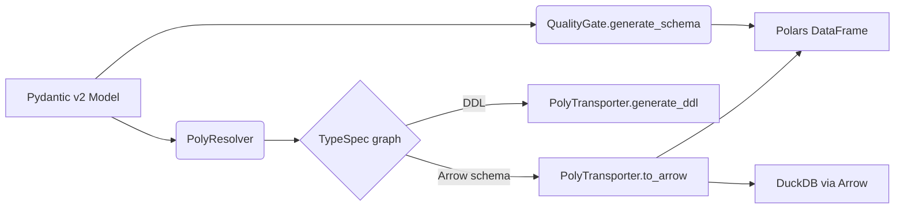

# politipo — PolyType Data Fabric

[](https://github.com/kevinsaltarelli/politipo/actions/workflows/ci.yml)


PolyType: Define once with Pydantic v2, move fast with Arrow, analyze anywhere with DuckDB/Polars, and validate at scale with Pandera — all with a zero-warning typing policy.

Highlights
- Define once: Pydantic v2 + Annotated metadata
- Transport fast: UUID as binary(16), Enums as dictionary, Vectors as FixedSizeList
- Validate vectorized: Pandera (Polars backend) with robust Pandas fallback
- Analyze anywhere: DuckDB + Polars; Kùzu DDL generation
- Lean installs: uv-first workflow; extras loaded on demand
- Zero warnings: strict, warning-free type checks across code and tests

Install

Use uv (recommended):

```
uv pip install politipo
```

Optional extras:
- Arrow/Parquet: `uv pip install 'politipo[arrow]'`
- Polars: `uv pip install 'politipo[polars]'`
- DuckDB: `uv pip install 'politipo[duckdb]'`
- Validation (Pandera): `uv pip install 'politipo[validation]'`
- Pandas fallback: `uv pip install 'politipo[pandas]'`
- SQLAlchemy types: `uv pip install 'politipo[sqlalchemy]'`
- Everything: `uv pip install 'politipo[all]'`

Quick Start

```python
from typing import Annotated
import uuid, datetime, decimal, enum
from pydantic import BaseModel, Field
import politipo as pt

class UserType(enum.Enum):
    ADMIN = "admin"
    USER = "user"

class Event(BaseModel):
    id: Annotated[uuid.UUID, pt.FieldInfo(primary_key=True)]  # PK
    cost: Annotated[decimal.Decimal, pt.Precision(18, 4), Field(gt=0)]  # constraints
    embedding: Annotated[list[float], "vector", 4] | None  # vector
    user_type: UserType
    timestamp: datetime.datetime

# Generate DDL
print(pt.generate_ddl(Event, "duckdb", "events"))
print(pt.generate_ddl(Event, "kuzu", "Events"))

# Create data
rows = [
    Event(
        id=uuid.uuid4(),
        cost=decimal.Decimal("10.5000"),
        embedding=[0.1, 0.2, 0.3, 0.4],
        user_type=UserType.ADMIN,
        timestamp=datetime.datetime.now(),
    )
]

# Arrow (install extra: 'arrow')
tbl = pt.to_arrow(rows)  # pyarrow.Table
print(tbl.schema)

# Polars + vectorized validation (install 'polars', 'validation', 'pandas')
df = pt.to_polars(rows, validate=True)
print(df)

# Ingest to DuckDB (install extra: 'duckdb')
import duckdb
con = duckdb.connect(":memory:")
pt.PolyTransporter(Event).ingest_duckdb(con, "events", rows)
print(con.sql("select count(*) from events"))
```

Core Concepts

- Precision: `Annotated[Decimal, pt.Precision(p, s)]` → Arrow decimal128, DuckDB DECIMAL(p,s)
- Vector[N]: `Annotated[list[float], "vector", N]` (sugar: `pt.Vector[N]`)
- Resolver → Specs: Maps model fields to TypeSpecs (String/Int/Float/Bool/UUID/Decimal/List/Struct/Enum)
- PolyTransporter:
  - `to_arrow(models)` → `pyarrow.Table`
  - `to_polars(models, validate=True)` → `polars.DataFrame`
  - `ingest_duckdb(con, table, models)` → high-throughput Arrow ingestion
  - `generate_ddl(dialect, table)` → DuckDB/Kùzu/portable SQL (or `sql+<dialect>` via SQLAlchemy)
- QualityGate:
  - `generate_schema(model, backend='polars'|'pandas')` → Pandera schema from Pydantic metadata
  - Extracts `gt/ge/lt/le/pattern`, `min_length/max_length`, `multiple_of`
- Pipeline:
  - `pt.from_models(rows).to_arrow().to_duckdb(con, 'tbl').to_polars(validate=True)`

Recipes

- Financial decimals: `Precision(38, 18)` for high-precision columns; DuckDB DECIMAL(38,18)
- Embeddings: `Annotated[list[float], "vector", 1536]` (or `pt.Vector[1536]`) → Arrow FixedSizeList(float32, 1536)
- Enums as dictionary: memory-efficient encoded storage via Arrow dictionary type
- Kùzu DDL: `generate_ddl('kuzu', 'Node')` builds STRUCT-based Node schema with PK

Design



- PolyResolver: Inspects model annotations (Annotated, FieldInfo) and builds TypeSpecs.
- TypeSpecs: Encode cross-backend behavior (Arrow type, SQL type, Kùzu type, serialization).
- PolyTransporter: High-throughput conversions to Arrow/Polars and ingestion to DuckDB.
- QualityGate: Pandera schema from model metadata; vectorized validation with Polars or Pandas fallback.

Missing-Extras UX

If a dependency is missing, you’ll see a helpful error:

```
Missing optional dependency 'pyarrow'.
Install with: uv pip install '.[arrow]'
```

Zero-Warning Type Checks

- Enforced via `ty` across library and tests. Dynamic/optional deps use precise runtime checks and local casts.
- Run locally: `make type` (CI fails on any type errors; warnings are eliminated).

Development (uv-only)

- Lint/format/type: `make lint`, `make fmt-check`, `make type` (zero warnings)
- Tests: `make test`, coverage: `make cov`
- Pre-commit: `make pre-commit`

Releases

- Semantic versioning
- Build with uv: `make build`
- Publish with uv (requires `UV_PUBLISH_TOKEN`): `make publish`
- Release flow: `make release` then push tags: `git push --follow-tags`
  - Current release: v0.3.0 — zero-warning type checks, stronger dynamic imports, updated docs
- CI auto-publish: pushing a tag like `v0.3.0` triggers a Trusted Publishing workflow to PyPI.

Contributing

- Issues and PRs welcome. Please run `make lint fmt-check type test` locally.

License

MIT
